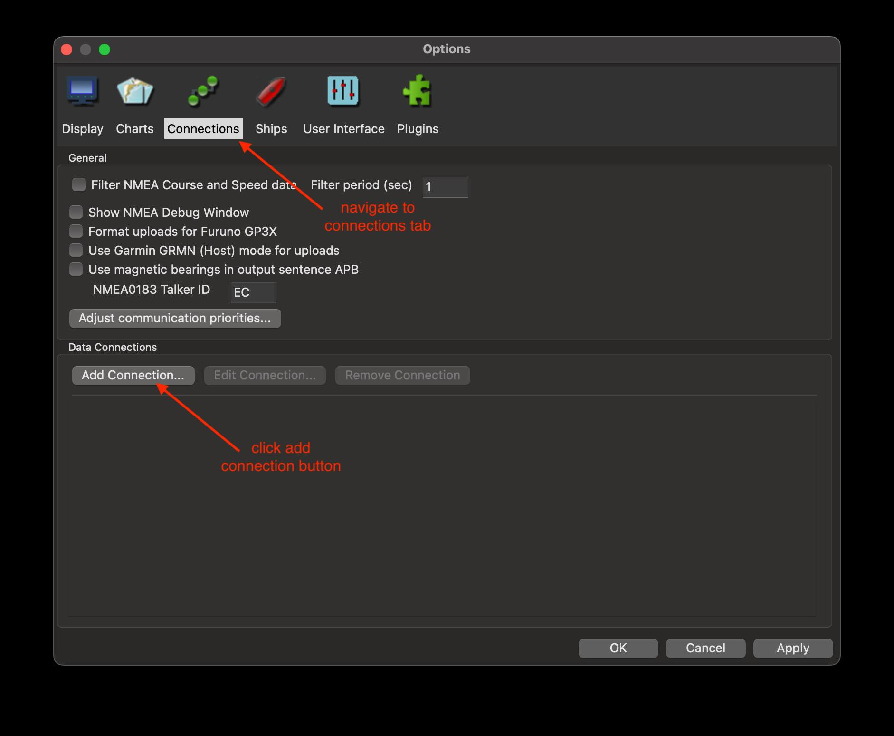

# MRT GPS Simulator

This is a simple GPS simulator. It simulates a static position/heading,
outputting a 1 Hz RMC message via UDP.

# Installation

Copy [mrt_gps_sim.py](mrt_gps_sim.py) to your machine. This script requires python3 >= 3.8.
Ubuntu 20.04 packages python3.8 by default.

# Usage

```bash
$ python3 mrt_gps_sim.py -h
usage: mrt_gps_sim.py [-h] [--heading-deg DEG] [--host HOST] [--port PORT] lat_deg lon_deg

positional arguments:
  lat_deg            Latitude in degrees
  lon_deg            Longitude in degrees

options:
  -h, --help         show this help message and exit
  --heading-deg DEG  Heading in degrees (default: 0.0)
  --host HOST        Host to send NMEA sentences to (default: 127.0.0.1)
  --port PORT        Port to send NMEA sentences to (default: 10110)
```

# Example

```bash
python3 mrt_gps_sim.py 38.315 -77.035
```

# Configure OpenCPN

1. Open `OpenCPN`, navigate to `Options`


2. Navigate to Connections tab, click the `Add Connection...` button



3. Add a UDP connection

- Type: Network
- Network Protocol: UDP
- Data Protocol: NMEA 0183
- Address: localhost
- Port: 10110
- Receive Input on this port: checked


4. Confirm and apply the new connection


5. Verify that the connection is active


